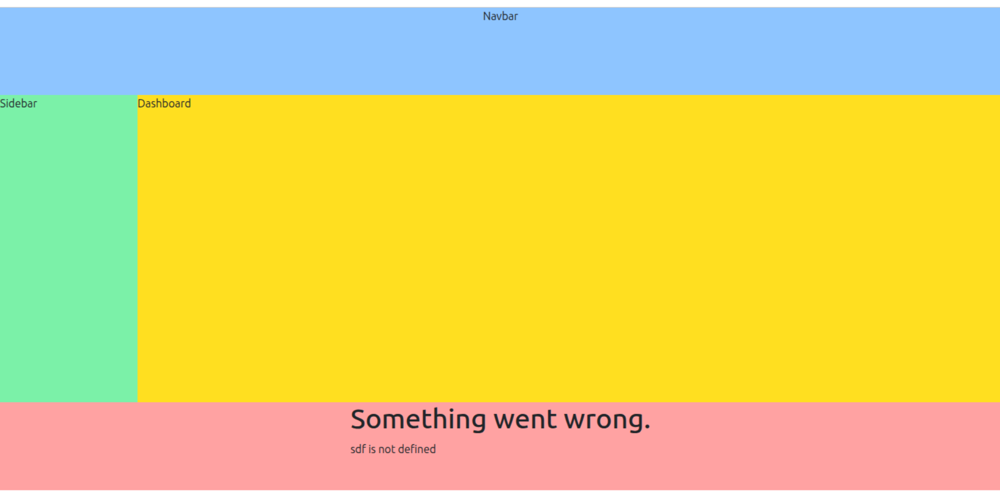

# React + Vite

This template provides a minimal setup to get React working in Vite with HMR and some ESLint rules.

Currently, two official plugins are available:

- [@vitejs/plugin-react](https://github.com/vitejs/vite-plugin-react/blob/main/packages/plugin-react/README.md) uses [Babel](https://babeljs.io/) for Fast Refresh
- [@vitejs/plugin-react-swc](https://github.com/vitejs/vite-plugin-react-swc) uses [SWC](https://swc.rs/) for Fast Refresh

# FAQ - 

### Why we need Error Boundary in ReactJs?

 Error Boundary is a component that catches errors in any of its child components and displays a fallback UI instead of the component tree that crashed.

### Why we need componentDidCatch hook in Error Boundary?

componentDidCatch is a lifecycle method that is called when an error occurs in a child component. It allows you to handle the error and display a fallback UI.

### It only work when?-

It only work when Crash happen during rendering, inside useEffect, inside Custom hook.

### When it will not work?

     Inside Event handler 
     Inside setTimeout
     Inside async code 

so if it will not work in above case then we need to use Custom hook to trigger Error boundary.

### Do i have always create Error Boundary in my component?

First of all Error Boundary only work with class component so we can use it otherwise we can use liberary for handle Error Boundary in ReactJs called [react-error-boundary](https://www.npmjs.com/package/react-error-boundary)
Behind the scene liberary also use the same class component way to handle error.

### Do i have to wrap every component with Error Boundary?

No, we can use Error Boundary in **Section** of code where we want to handle error.
      Like we have navbar,sidebar,footer and dashboard component so we can wrap them with Error Boundary.If any one of section crash then it will show fallback UI not whole page.

#### Example of Section - 

 

Here Only Footer have error so it will show fallback UI not whole page.